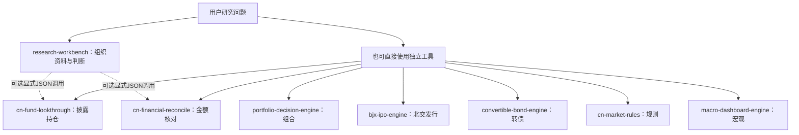

# 按问题选择工具

更新日期：2026-10-09。本页随待审主包更新。八个仓库分别开发、测试和发布；存在仓库不等于主包已集成其全部能力。

|你想解决什么|工具|交付与衔接范围|
|---|---|---|
|研究公司、基金、ETF，比较产品，找回报告继续问|[research-workbench](https://github.com/KILING-TASI/research-workbench)|理解问题、组织公开资料、建立判断并生成报告；工作台可选|
|多只基金是否重复持有同一批公司|[cn-fund-lookthrough](https://github.com/KILING-TASI/cn-fund-lookthrough)|证券/公司敞口、未知路径、已映射股票集中度；主包已有显式JSON桥，待审增量限定单管理人PDF桥|
|财报金额是不是同口径、原文差多少|[cn-financial-reconcile](https://github.com/KILING-TASI/cn-financial-reconcile)|金额差异/舍入/不可比；主包有显式JSON桥，待审行列定位仍限定金额，不是完整三表认证|
|比较组合配置、回撤预算、成本与现金流|[portfolio-decision-engine](https://github.com/KILING-TASI/portfolio-decision-engine)|独立组合研究；主包等价迁移尚未验收，不自动替换既有模型|
|北交网上发行比例获配情景、占款与复盘|[bjx-ipo-engine](https://github.com/KILING-TASI/bjx-ipo-engine)|独立发行情景研究；主包保留已有北交专题，未完成全部等价迁移|
|可转债现金流、收益率与条款条件|[convertible-bond-engine](https://github.com/KILING-TASI/convertible-bond-engine)|独立转债研究；按其README输入，不把主包基础诊断说成含权定价|
|证券市场规则、个案条款与离线情景|[cn-market-rules](https://github.com/KILING-TASI/cn-market-rules)|规则清单与条款模板；不是交易许可认证，不默认被主包执行|
|公开宏观数据与周期代理指标看板|[macro-dashboard-engine](https://github.com/KILING-TASI/macro-dashboard-engine)|独立宏观看板；不是主包全量数据库或自动后台监控|

## 八仓关系

虚线只代表已提供的可选显式JSON接口；未画连线的工具不意味着主包已经自动调用。用户不必安装八个仓库。主包不自动下载或安装独立工具，调用者明确可信目录；各仓库的README和版本记录决定实际可运行范围。

## 先看什么结果

- [主包教学比较预览](examples/readme-preview.html)：说明共同区间表现取舍，不是完整基金评价。
- [独立持仓预览](https://github.com/KILING-TASI/cn-fund-lookthrough/blob/codex/bounded-research-extensions/examples/readme-preview.html)：已知/未知一起展示，不把覆盖率当准确率。
- [独立财报预览](https://github.com/KILING-TASI/cn-financial-reconcile/blob/codex/bounded-research-extensions/examples/readme-preview.html)：数值结论与原页状态分开。

HTML需下载后用浏览器打开。三份均为实际demo生成的教学结果，尚无截图或视觉验收；输入与生成记录在对应README中。三个待审分支未合并，链接指向待审版本，不代表发布包已有这些预览。

## 有限真实案例与缺口

007119中报77条股票的独立适配与旧主包逐项等价，财报原表选定六个金额重新提取一致；见[本批验证](development-validation.md)。原件不随代码发布；这不能外推到其他管理人/任意版式。第二管理人、机构预测留档和REITs估值仍未实现，不列为已支持。更完整的接口与迁移边界见[独立工具衔接](independent-engines.md)。
